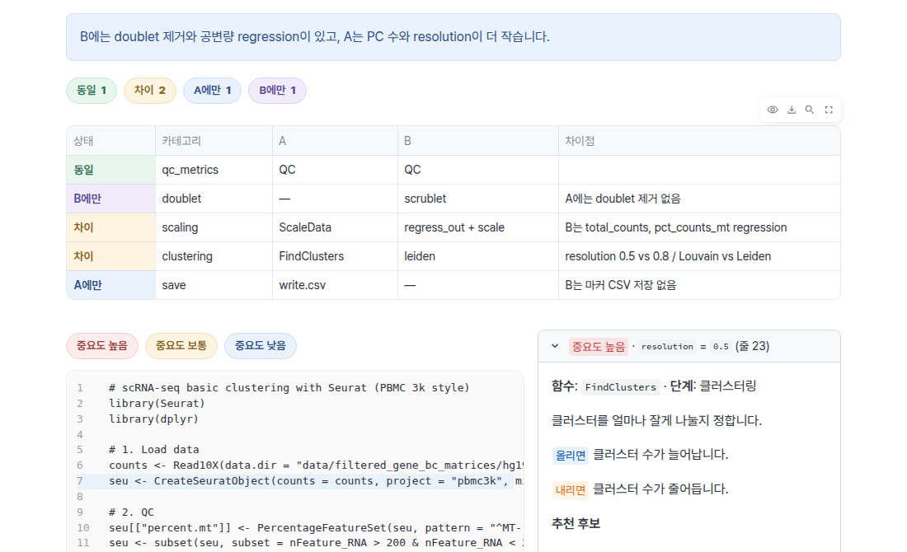

<p align="center">
  
</p>

<h1 align="center">BI Pipeline Assistant</h1>

<p align="center">
  Bioinformatics 파이프라인을 <b>변환</b>하고, <b>비교</b>하고, <b>쉽게 조정</b>하는 웹 도우미
</p>

<p align="center">
  <a href="https://gitlab.bionexus.co.kr/bionexus-enterprise/dev/sandbox/jaehyung/bi-pipeline-assistant">GitLab (사내)</a> ·
  <a href="https://github.com/andrew010417/bi-pipeline-assistant">GitHub</a>
</p>


> 설계 설명 발표 자료: [docs/BI_Pipeline_Assistant_설계.pptx](docs/BI_Pipeline_Assistant_설계.pptx) (슬라이드 노트에 설명 포함)

## 왜 만들었나요

Bioinformatics 분석은 R과 Python이 섞여 있고, 논문이나 튜토리얼에서 가져온 파이프라인과 직접 만든 파이프라인이 조금씩 다릅니다. 또 어떤 parameter를 바꿔야 결과가 달라지는지는 경험이 있어야 압니다.
BI Pipeline Assistant는 이 세 가지 반복 작업을 한 화면에서 해결합니다.

| 기능 | 하는 일 | 이럴 때 |
|---|---|---|
| **① R ↔ Python 변환** | R 파이프라인은 Python으로, Python 파이프라인은 R로 변환합니다. 필요하면 변환한 코드를 실행하고, 에러가 나면 최대 3번까지 스스로 고칩니다. | 논문 코드는 R인데 팀은 Python을 쓸 때 |
| **② 파이프라인 비교** | 내 파이프라인(A)과 참고 파이프라인(B)을 단계별로 맞춰 보고, 서로 빠진 단계와 다른 설정을 찾아 보완 코드를 제안합니다. | 놓친 QC나 doublet 제거 단계를 점검할 때 |
| **③ Parameter 가이드** | 바꿔볼 만한 parameter의 위치(줄 번호), 중요도, 추천 후보값을 쉬운 말로 알려줍니다. | 비전공자가 분석 조건을 조정해야 할 때 |

- AI는 **Claude(Anthropic)** 와 **GPT(OpenAI)** 중에서 고를 수 있습니다.
- API 키가 없어도 ③은 **오프라인 모드**로 무료로 동작합니다.

결과는 상태와 중요도에 따라 연한 색으로 구분됩니다.



분석이 도는 동안에는 화면 위쪽에 축구장이 나타나서, 작업이 끝날 때까지 선수가 공을 몰고 골대로 달려갑니다. ⚽


## 빠른 시작

**Python 3.10 이상**이 필요합니다. `python3 --version`으로 확인하세요.

```bash
git clone https://gitlab.bionexus.co.kr/bionexus-enterprise/dev/sandbox/jaehyung/bi-pipeline-assistant.git
cd bi-pipeline-assistant
python3 -m venv .venv && source .venv/bin/activate
pip install -r requirements.txt
cp .env.example .env           # API 키 입력 (아래 '설정' 참고)
streamlit run app.py           # 브라우저에서 http://localhost:8501
```

다음부터는 아래 두 줄이면 됩니다. 앱을 끌 때는 터미널에서 `Ctrl + C`를 누르세요.

```bash
source .venv/bin/activate
streamlit run app.py
```

<details>
<summary>Mac에서 <code>pip: command not found</code>가 나오거나 Python이 3.9 이하일 때</summary>

Mac 기본 Python은 3.9라서 새로 설치해야 합니다. Homebrew를 쓴다면:

```bash
brew install python@3.11
python3.11 -m venv .venv
source .venv/bin/activate
pip install -r requirements.txt
```

conda를 쓴다면 `conda create -n bi-assistant python=3.11 -y && conda activate bi-assistant` 후 `pip install -r requirements.txt`.
</details>

<details>
<summary>최신 코드로 업데이트하기</summary>

```bash
git pull
pip install -r requirements.txt   # 새 패키지가 추가됐을 수 있으므로
```

`.env`는 저장소에 올라가지 않으므로 업데이트해도 그대로 유지됩니다.
</details>

## 사용 방법

각 탭에서 입력 방식을 **예제 / 파일 업로드 / 직접 붙여넣기** 중에서 고릅니다. 지원 형식은 `.R`, `.Rmd`, `.qmd`, `.py`, `.ipynb`, `.smk`, `.nf`입니다.

1. **① R ↔ Python 변환**
   - 파일을 넣고 **변환** 버튼을 누르면 변환된 코드, 패키지 대응표, 주의사항이 나옵니다. 변환된 코드는 다운로드할 수 있습니다.
   - "변환 후 실행해서 검증"을 켜면 코드를 실제로 실행해 확인합니다. 대상 언어와 패키지, 데이터가 설치되어 있어야 합니다.
2. **② 파이프라인 비교**
   - A에 내 파이프라인, B에 참고 파이프라인을 넣고 **비교하기**를 누릅니다.
   - 비교표에서 각 단계가 동일 / 차이 / A에만 / B에만 중 어디에 해당하는지 보여주고, 보완 코드를 제안합니다.
3. **③ Parameter 가이드**
   - 파일을 넣고 버튼을 누르면 코드에서 해당 줄이 중요도별 색으로 표시됩니다.
   - 오른쪽 목록을 펼치면 설명과 추천값을 볼 수 있습니다.

> 처음이라면 미리 선택된 예제(PBMC 3k, Seurat ↔ scanpy)로 바로 눌러보세요. ②에서는 두 예제의 차이(doublet 제거, regression, PC 수, resolution)를 찾아냅니다.

## 설정 (`.env`)

Claude와 GPT 중 **키가 있는 쪽**을 자동으로 사용합니다. 두 키가 모두 있으면 왼쪽 사이드바에서 고를 수 있습니다.

| 변수 | 기본값 | 설명 |
|---|---|---|
| `ANTHROPIC_API_KEY` | - | Claude API 키 (https://console.anthropic.com) |
| `OPENAI_API_KEY` | - | OpenAI API 키 (https://platform.openai.com/api-keys). ChatGPT Plus 구독과는 별개로 **API 크레딧**이 필요합니다 |
| `BI_ASSISTANT_MODEL` | `claude-opus-5-5` | Claude 모델 |
| `OPENAI_MODEL` | `gpt-5.5` | GPT 모델. 비용을 줄이려면 `gpt-5.4-mini` 같은 mini 모델을 쓰세요 |
| `BI_ASSISTANT_PROVIDER` | (자동) | 두 키가 다 있을 때 처음에 쓸 쪽: `anthropic` / `openai` |
| `BI_ASSISTANT_EFFORT` | `high` | Claude 전용: `low` / `medium` / `high` / `xhigh` / `max` (낮을수록 빠르고 저렴합니다) |
| `BI_ASSISTANT_MAX_TOKENS` | `16000` | 응답 최대 길이 (긴 파이프라인을 변환할 때 늘리세요) |
| `BI_ASSISTANT_OUTPUT_LANGUAGE` | `Korean` | 설명 언어 |

**비용 관리 팁**

- 버튼 한 번에 AI를 2번 호출합니다(구조 분석 1번 + 기능 1번). 같은 파일의 구조 분석 결과는 재사용됩니다.
- 입력 코드가 길수록 비용이 늘어납니다. 처음엔 `examples/`의 짧은 예제로 테스트하세요.
- OpenAI(**Settings → Limits**)나 Anthropic Console의 사용 한도 설정에서 월 한도를 걸어두면 안전합니다.

## 주의사항

- **보안**: 코드가 외부 API(Claude 또는 OpenAI)로 전송됩니다. 회사 파이프라인이나 데이터 경로를 보내도 되는지 사내 정책을 먼저 확인하세요. 사내 모델을 연결하려면 `bi_assistant/llm.py`만 수정하면 됩니다.
- **실행 검증**(① 탭 체크박스)은 생성된 코드를 이 컴퓨터에서 그대로 실행합니다. 신뢰할 수 있는 환경에서만 사용하세요.
- **변환 결과 차이**: 패키지 간 기본값과 알고리즘 차이(예: Louvain vs Leiden) 때문에 변환 전후 숫자가 완전히 같지 않을 수 있습니다. ①의 주의사항을 꼭 확인하세요.

## 동작 원리

세 기능은 모두 **공통 파서**가 만든 같은 중간 표현(`PipelineIR`)을 사용합니다. `PipelineIR`에는 단계, 도구, 입출력, parameter가 담깁니다.

```
입력 (.R .Rmd .qmd .py .ipynb .smk .nf)
   │  loader.py      파일 형식별로 코드만 추출
   │  static_scan.py LLM 없이 parameter 위치를 찾음
   ▼
 parser.py ──► PipelineIR (schemas.py)
   │
   ├─► features/converter.py      ① 변환 + 실행 검증 루프
   ├─► features/comparator.py     ② 단계 정렬, 차이점, 보완 코드
   └─► features/param_advisor.py  ③ parameter 위치, 후보값, 설명
```

AI 응답은 모두 Pydantic 스키마로 검증된 구조화된 출력입니다. 그래서 화면에 표, 배지, 줄 강조로 안정적으로 표시할 수 있습니다.

```
bi-pipeline-assistant/
├── app.py                      # Streamlit 웹 UI (탭 3개)
├── .streamlit/config.toml      # 글꼴(Pretendard) · 기본 색 설정
├── static/fonts/               # Pretendard 폰트 파일
├── assets/bionexus_logo.png    # 회사 로고
├── bi_assistant/
│   ├── ui.py                   # 디자인: 로고, 제목, 탭, 기능 설명, 결과 색, 축구 로딩 애니메이션
│   ├── config.py               # 환경 변수 설정
│   ├── llm.py                  # AI 호출부: Claude / GPT
│   ├── schemas.py              # Pydantic 모델 (구조화된 출력)
│   ├── loader.py               # .ipynb / .Rmd 등에서 코드 추출
│   ├── static_scan.py          # 오프라인 parameter 스캐너
│   ├── parser.py               # 공통 코어: 코드 → PipelineIR
│   ├── features/               # ① ② ③
│   └── knowledge/              # 도메인 지식 (여기를 채울수록 품질이 좋아짐)
│       ├── package_map.yaml    #   R ↔ Python 패키지/함수 대응표
│       ├── canonical_steps.yaml#   비교 기준이 되는 표준 분석 단계
│       └── param_hints.yaml    #   parameter별 설명과 추천값
├── examples/                   # Seurat(R) / scanpy(Python) 예제 파이프라인
├── docs/                       # README 이미지
└── tests/
```

**품질을 올리는 가장 쉬운 방법**은 `bi_assistant/knowledge/`의 YAML 파일에 우리 팀이 자주 쓰는 패키지 대응, 분석 단계, parameter 추천값을 추가하는 것입니다. 코드는 고칠 필요가 없습니다.

## 디자인 바꾸기

화면 디자인은 `bi_assistant/ui.py`에, 글꼴과 기본 색은 `.streamlit/config.toml`에 있습니다. 고친 뒤에는 앱을 껐다 켜야 반영됩니다.

| 바꾸고 싶은 것 | 수정할 곳 |
|---|---|
| 로고 이미지 | `assets/bionexus_logo.png` 파일 교체 |
| 로고 옆 회사 이름 | `ui.py`의 `COMPANY_NAME` |
| 제목 · 부제목 문구 | `ui.py`의 `HERO_HTML` |
| 각 탭 상단 상세 설명 | `ui.py`의 `FEATURE_INTROS` |
| 결과 화면 파스텔 색 (비교 상태, 중요도) | `ui.py`의 `PASTEL`, `STATUS`, `IMPORTANCE` |
| 탭별 연한 색 | `ui.py`의 `[data-testid="stTab"]:nth-child(...)`의 `--bi-tab-*` 값 |
| 버튼 · 선택 표시 색 | `.streamlit/config.toml`의 `primaryColor` |
| 축구 애니메이션 속도 · 잔디 색 · 모양 | `ui.py`의 `RUNNING_ICON_CSS` (`5s`, `.6s`, `#3f9b3f`, `🏃` `⚽` `🥅`) |

글꼴은 **Pretendard**입니다. 폰트 파일이 저장소에 들어 있어서 인터넷이 없어도 적용됩니다. Pretendard는 [SIL Open Font License](static/fonts/Pretendard-LICENSE.txt)로 배포됩니다.

## 개발

```bash
pytest -q
```

LLM 호출은 mock 처리되어 있어서 API 키 없이 테스트할 수 있습니다. GitLab CI(`.gitlab-ci.yml`)와 GitHub Actions(`.github/workflows/ci.yml`)에서 같은 테스트를 실행합니다.

GitLab(사내)과 GitHub 두 곳에 같은 코드를 올립니다.

```bash
git remote add gitlab https://gitlab.bionexus.co.kr/bionexus-enterprise/dev/sandbox/jaehyung/bi-pipeline-assistant.git
git push gitlab HEAD:main
```

## 로드맵

- [ ] 변환 검증: 원본과 변환본의 실행 결과(클러스터 수, DE 유전자 목록 등) 자동 비교
- [ ] ③ 결과에서 후보값을 고르면 수정된 코드를 바로 다운로드
- [ ] bulk RNA-seq (DESeq2 ↔ PyDESeq2) 예제 추가
- [ ] Snakemake / Nextflow 파이프라인 지원 강화
- [ ] 사내 배포 (Docker + 사내 LLM 옵션)
