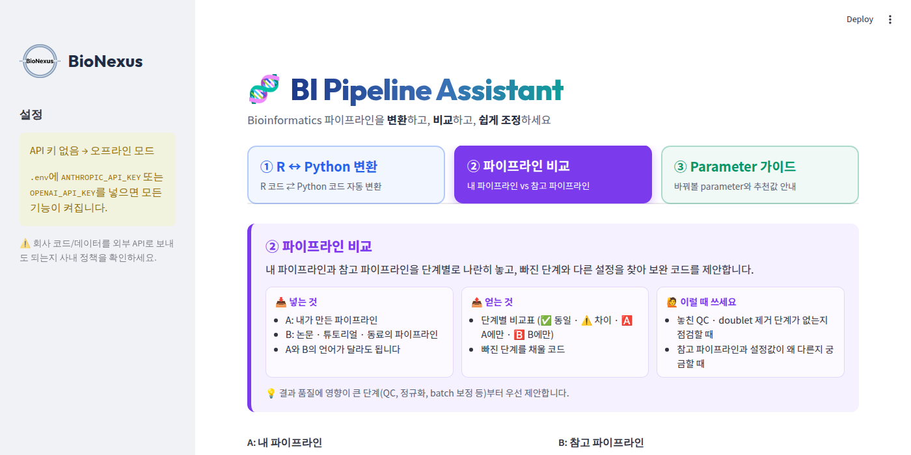
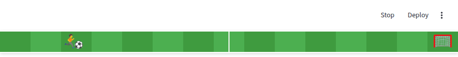

# 🧬 BI Pipeline Assistant

bioinformatics 분석 파이프라인(R / Python)을 위한 웹 도우미입니다. 한 화면에 세 가지 기능이 있습니다.



| 탭 | 기능 | 방식 |
|---|---|---|
| ① R ↔ Python 변환 | R 파이프라인은 Python으로, Python 파이프라인은 R로 변환 | 에이전트: 변환 → 실행 → 에러를 다시 보내 수정 (최대 3회) |
| ② 파이프라인 비교 | 내 파이프라인(A)과 참고 파이프라인(B)을 단계별로 맞춰 비교하고, 서로 빠진 부분을 코드로 제안 | 워크플로 |
| ③ Parameter 가이드 | 비전공자도 바꿔볼 수 있도록 수정할 parameter의 위치(줄 번호), 중요도, 추천 후보값을 안내 | 워크플로 (API 키 없이도 오프라인 모드로 동작) |

AI는 **Claude(Anthropic)와 GPT(OpenAI) 중 원하는 쪽**을 쓸 수 있습니다.

### ⚽ 로딩 화면

분석이 돌아가는 동안 화면 위쪽에 축구장이 나타나고, 선수가 왼쪽부터 공을 몰고 가서 오른쪽 골대에 골을 넣는 동작을 작업이 끝날 때까지 반복합니다. 작업이 끝나면 축구장은 사라집니다.



## 구조

세 기능 모두 **공통 파서**가 만든 같은 중간 표현(`PipelineIR`: 단계, 도구, 입출력, parameter)을 사용합니다.

```
입력 (.R .Rmd .qmd .py .ipynb .smk .nf)
   │  loader.py      파일 형식별로 코드만 추출
   │  static_scan.py LLM 없이 keyword argument 위치를 찾음
   ▼
 parser.py ──► PipelineIR (schemas.py)
   │
   ├─► features/converter.py      ① 변환 + 실행 검증 루프
   ├─► features/comparator.py     ② 단계 정렬, 차이점, 보완 코드
   └─► features/param_advisor.py  ③ parameter 위치, 후보값, 설명
```

```
bi-pipeline-assistant/
├── app.py                      # Streamlit 웹 UI (탭 3개)
├── assets/bionexus_logo.png    # 회사 로고 (왼쪽 위)
├── bi_assistant/
│   ├── ui.py                   # 디자인: 글꼴, 로고, 제목, 탭, 기능 설명, 축구 로딩 애니메이션
│   ├── config.py               # 환경 변수 설정
│   ├── llm.py                  # AI 호출부: Claude / GPT (다른 모델 추가 시 이 파일만 수정)
│   ├── schemas.py              # Pydantic 모델 (구조화된 출력)
│   ├── loader.py               # .ipynb / .Rmd 등에서 코드 추출
│   ├── static_scan.py          # 오프라인 parameter 스캐너
│   ├── parser.py               # 공통 코어: 코드 → PipelineIR
│   ├── features/               # ① ② ③
│   └── knowledge/              # 도메인 지식 (여기를 채울수록 품질이 좋아짐)
│       ├── package_map.yaml    #   R ↔ Python 패키지/함수 대응표
│       ├── canonical_steps.yaml#   비교 기준이 되는 표준 분석 단계
│       └── param_hints.yaml    #   parameter별 설명과 추천값
├── examples/                   # Seurat(R) / scanpy(Python) 예제 파이프라인
├── docs/                       # README용 이미지
└── tests/
```

## 실행

**Python 3.10 이상**이 필요합니다. `python3 --version`으로 확인하세요.

```bash
git clone https://github.com/andrew010417/bi-pipeline-assistant.git
cd bi-pipeline-assistant
python3 -m venv .venv && source .venv/bin/activate
pip install -r requirements.txt
cp .env.example .env           # ANTHROPIC_API_KEY 또는 OPENAI_API_KEY 입력
streamlit run app.py           # 브라우저에서 http://localhost:8501
```

다음부터는 폴더에 들어가서 `source .venv/bin/activate` 후 `streamlit run app.py`만 하면 됩니다. 앱을 끌 때는 터미널에서 `Ctrl + C`.

API 키가 없으면 ③ Parameter 가이드만 오프라인 모드(정적 분석 + `param_hints.yaml`)로 동작합니다.

<details>
<summary>Mac에서 <code>pip: command not found</code>가 나오거나 Python이 3.9 이하일 때</summary>

Mac 기본 Python은 3.9라서 새로 설치해야 합니다. Homebrew가 있다면:

```bash
brew install python@3.11
python3.11 -m venv .venv
source .venv/bin/activate
pip install -r requirements.txt
```

conda를 쓴다면 `conda create -n bi-assistant python=3.11 -y && conda activate bi-assistant` 후 `pip install -r requirements.txt`.
</details>

<details>
<summary>코드 업데이트 받기</summary>

```bash
git pull
pip install -r requirements.txt   # 새 패키지가 추가됐을 수 있으므로
```
`.env`는 GitHub에 올라가지 않으므로 업데이트해도 그대로 유지됩니다.
</details>

### 설정 (`.env`)

Claude와 GPT 중 **키가 있는 쪽**을 자동으로 사용합니다. 두 키가 모두 있으면 웹 화면 왼쪽 사이드바에서 고를 수 있습니다.

| 변수 | 기본값 | 설명 |
|---|---|---|
| `ANTHROPIC_API_KEY` | - | Claude API 키 (https://console.anthropic.com) |
| `OPENAI_API_KEY` | - | OpenAI API 키 (https://platform.openai.com/api-keys). ChatGPT Plus 구독과는 별개로 **API 크레딧**이 필요 |
| `BI_ASSISTANT_MODEL` | `claude-opus-5-5` | Claude 모델 |
| `OPENAI_MODEL` | `gpt-5.5` | GPT 모델. 비용을 줄이려면 `gpt-5.4-mini` 같은 mini 모델 |
| `BI_ASSISTANT_PROVIDER` | (자동) | 두 키가 다 있을 때 시작 시 사용할 쪽: `anthropic` / `openai` |
| `BI_ASSISTANT_EFFORT` | `high` | Claude 전용: `low` / `medium` / `high` / `xhigh` / `max` (낮을수록 빠르고 저렴함) |
| `BI_ASSISTANT_MAX_TOKENS` | `16000` | 응답 최대 길이 (긴 파이프라인을 변환할 때 늘리기) |
| `BI_ASSISTANT_OUTPUT_LANGUAGE` | `Korean` | 설명 언어 |

**비용 관리 팁**
- 버튼 한 번에 AI를 2번 호출합니다(구조 분석 1번 + 기능 1번). 같은 파일의 구조 분석 결과는 재사용됩니다.
- 입력 코드가 길수록 비용이 늘어납니다. 처음엔 `examples/`의 짧은 예제로 테스트하세요.
- OpenAI(platform.openai.com의 **Settings → Limits**)나 Anthropic Console의 사용 한도 설정에서 월 한도를 걸어두면 안전합니다.

## 테스트

```bash
pytest -q
```

LLM 호출은 mock 처리되어 있어서 API 키 없이 돌아갑니다. GitHub Actions(`.github/workflows/ci.yml`)와 GitLab CI(`.gitlab-ci.yml`)에서 같은 테스트를 실행합니다.

## GitHub와 회사 GitLab에 함께 올리기

```bash
git remote add gitlab https://<회사-gitlab>/<group>/bi-pipeline-assistant.git
git push gitlab HEAD             # 지금 브랜치를 GitLab에도 올림
```

또는 GitLab 프로젝트 설정의 **Repository → Mirroring repositories**에서 GitHub 저장소를 pull mirror로 등록하면 자동으로 동기화됩니다.

## 주의사항

- **보안**: 코드가 외부 API(Claude 또는 OpenAI)로 전송됩니다. 회사 파이프라인이나 데이터 경로를 보내도 되는지 사내 정책을 먼저 확인하세요. 사내 모델을 추가하려면 `bi_assistant/llm.py`만 수정하면 됩니다.
- **실행 검증**(① 탭 체크박스)은 생성된 코드를 이 컴퓨터에서 그대로 실행합니다. 대상 언어의 인터프리터(`python3` / `Rscript`), 패키지, 입력 데이터가 있어야 하며, 신뢰할 수 있는 환경에서만 사용하세요.
- 변환 결과는 패키지 간 기본값과 알고리즘 차이(예: Louvain vs Leiden) 때문에 숫자가 완전히 같지 않을 수 있습니다. ①의 "주의사항"을 꼭 확인하세요.

## 꾸미기

화면 디자인은 모두 `bi_assistant/ui.py`에 모여 있습니다.

| 바꾸고 싶은 것 | 수정할 곳 (`bi_assistant/ui.py`) |
|---|---|
| 로고 이미지 | `assets/bionexus_logo.png` 파일 교체 |
| 로고 옆 회사 이름 | `COMPANY_NAME` |
| 제목 · 부제목 문구 | `HERO_HTML` |
| 제목 글씨 색 (그라데이션) | `.bi-hero-text`의 `linear-gradient(...)` |
| 탭별 색상 | `TAB_COLORS`와 `[data-testid="stTab"]:nth-child(...)`의 `--bi-accent` |
| 탭 아래 한 줄 설명 | `[data-testid="stTab"]:nth-child(...)::after`의 `content` |
| 각 탭 상단 상세 설명 | `FEATURE_INTROS` |
| 선수가 골대까지 가는 시간 | `bi-run-across`, `bi-ball-across`의 `5s` (두 곳을 같은 값으로) |
| 드리블 속도 | `bi-dribble`의 `.6s` |
| 잔디 색 | `#3f9b3f`, `#4caf50` |
| 선수/공/골대 모양 | `content: "🏃"`, `"⚽"`, `"🥅"` |

글꼴은 Google Fonts의 **Outfit**(영문 제목)과 **Noto Sans KR**(한글)을 사용합니다. 인터넷이 안 되는 환경에서는 기본 글꼴로 표시됩니다.

## 로드맵

- [ ] 변환 검증: 원본과 변환본의 실행 결과(클러스터 수, DE 유전자 목록 등) 자동 비교
- [ ] ③ 결과에서 후보값을 고르면 수정된 코드를 바로 다운로드
- [ ] bulk RNA-seq (DESeq2 ↔ PyDESeq2) 예제 추가
- [ ] Snakemake / Nextflow 파이프라인 지원 강화
- [ ] 사내 배포 (Docker + 사내 LLM 옵션)
